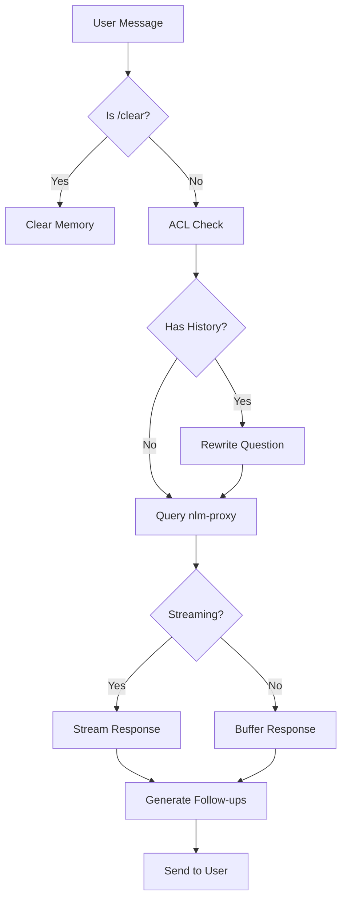

# LangChain / LangGraph Agent Migration Analysis

## Current Architecture Snapshot

### What You Have Today

| Component | Technology | Purpose |
|-----------|-----------|---------|
| Query / Streaming | `AsyncOpenAI` (raw SDK) | Calls nlm-proxy Chat Completions endpoint, preserves `reasoning_content` |
| Rewrite / Follow-up | `ChatOpenAI` (LangChain) | Uses `ainvoke()` with message types for LLM tasks |
| Memory | `ConversationMemoryManager` | Custom TTLCache + `langchain-core` message types (`HumanMessage`, `AIMessage`) |
| Orchestration | **Manual** (imperative Python) | Sequential flow in `on_message()`: ACL → rewrite → query → followup → respond |
| Bot Framework | M365 Agents SDK | Handles Teams/DirectLine channels, streaming |

### Installed Versions (as of today)

| Package | Installed | Latest Available |
|---------|-----------|-----------------|
| `langchain-openai` | **1.1.9** | 1.1.9 ✅ (released Feb 10, 2026) |
| `langchain-core` | **1.2.12** | 1.2.x ✅ |
| `langgraph` | **not installed** | 1.0.8 (released Feb 6, 2026) |
| `langchain` | **not installed** | 1.0.x |

### Key Insight

> Your project **already runs the latest LangChain ecosystem packages** (`langchain-openai 1.1.9`, `langchain-core 1.2.12`). You are NOT on outdated versions. The question is whether to adopt **LangGraph** (the orchestration layer) — not whether to "upgrade LangChain".

---

## What's New in LangChain / LangGraph 1.0

### LangChain 1.0 (October 2025)

- **`create_agent` abstraction** — standard way to build agents, built on LangGraph runtime
- **Standard Content Blocks** — provider-agnostic output format across LLMs
- **Streamlined namespace** — trimmed down to essential agent components
- **Enhanced Middleware** (v1.1) — auto-retries, content moderation, context-aware summarization
- **Deprecated**: `initialize_agent()`, `AgentExecutor` → use `create_agent()` or LangGraph directly

### LangGraph 1.0.8 (February 2026)

- **Graph-based orchestration** — model workflows as directed graphs with nodes and edges
- **Durable execution** — persist agent state, resume after failures
- **Human-in-the-loop (HITL)** — pause for human approval at any node
- **Built-in memory** — short-term + long-term persistence across sessions
- **Node-level caching** — avoid redundant LLM calls during development
- **Multi-agent systems** — orchestrate multiple specialized agents
- **LangSmith integration** — tracing, time-travel debugging, evaluation

### Coming: LangGraph 2.0 (Q2 2026)

- Greater API stability
- Improved type safety
- Guardrail nodes (content filtering, rate limiting, compliance)
- Cloud-native persistence backends

---

## Your Bot's Workflow Mapped to LangGraph Concepts



If you rewrote this as a LangGraph `StateGraph`:

```python
from langgraph.graph import StateGraph, END

builder = StateGraph(ChatState)
builder.add_node("acl_check", acl_check_node)
builder.add_node("rewrite", rewrite_question_node)
builder.add_node("query", query_nlm_proxy_node)
builder.add_node("followup", generate_followup_node)
builder.add_node("respond", send_response_node)

builder.add_edge("acl_check", "rewrite")
builder.add_conditional_edges("rewrite", has_history, {"yes": "query", "no": "query"})
builder.add_edge("query", "followup")
builder.add_edge("followup", "respond")
builder.add_edge("respond", END)

graph = builder.compile(checkpointer=MemorySaver())
```

---

## Should You Migrate? Pros / Cons

### ✅ Pros of Adopting LangGraph

| Benefit | Relevance to Your Bot |
|---------|----------------------|
| **Visual workflow** — graph nodes make flow explicit | 🟡 Medium — your flow is already clear in `on_message()` |
| **Durable state** — resume after crashes | 🟡 Medium — chatbot is stateless per-request, TTLCache is ephemeral by design |
| **Human-in-the-loop** — pause for approval | 🔴 Low — your bot doesn't need approval steps |
| **Multi-agent** — orchestrate multiple LLMs | 🔴 Low — you have a single backend (nlm-proxy) |
| **Built-in memory** — checkpointed across sessions | 🟡 Medium — you already have `ConversationMemoryManager` with TTLCache |
| **LangSmith debugging** — trace execution | 🟢 High — useful for production debugging |
| **Future-proof** — LangChain ecosystem direction | 🟢 High — `create_agent` is built on LangGraph |
| **Standardized patterns** — community examples | 🟡 Medium — easier onboarding for new contributors |

### ❌ Cons of Adopting LangGraph

| Concern | Impact |
|---------|--------|
| **Significant refactoring** — rewrite `on_message()`, `NLMClient`, memory | 🔴 High — ~500+ lines of working, tested code to restructure |
| **New dependency** — `langgraph` adds ~50-100MB | 🟡 Medium — heavier deployment |
| **`reasoning_content` gap** — LangChain `ChatOpenAI` still drops `reasoning_content` in Chat Completions SSE format | 🔴 **Critical** — your ADR-012 hybrid approach exists because of this. LangGraph won't fix it — you'd still need raw `AsyncOpenAI` for streaming |
| **Streaming complexity** — M365 SDK `StreamingResponse` is tightly coupled to your bot handler | 🔴 High — LangGraph streaming is its own paradigm, integrating with M365 SDK `queue_text_chunk()` is non-trivial |
| **Over-engineering risk** — your flow is linear (ACL → rewrite → query → followup → respond) | 🟡 Medium — LangGraph shines for complex branching, your flow is mostly sequential |
| **Testing overhead** — rewrite 90+ tests for new architecture | 🔴 High — significant test investment |
| **Learning curve** — graph-based thinking, state management, checkpointers | 🟡 Medium |
| **LangSmith dependency** — full observability requires LangSmith (paid service) | 🟡 Medium — structlog already provides good logging |

---

## Recommendation

### 🟢 Verdict: **Do NOT migrate now. Re-evaluate when triggered.**

Your current architecture is well-designed for its purpose:

1. **Your flow is linear** — ACL → rewrite → query → followup → respond. LangGraph's graph-based orchestration is designed for complex branching, loops, and multi-agent collaboration. Your bot doesn't need these.

2. **The `reasoning_content` blocker is still present** — LangChain's `ChatOpenAI` (even v1.1.9) does not support `reasoning_content` via Chat Completions SSE. Your ADR-012 hybrid approach (`AsyncOpenAI` for streaming) would still be required, negating a key benefit of going "all LangChain".

3. **M365 SDK coupling** — Your `StreamingResponse` integration with `queue_text_chunk()` / `queue_informative_update()` is specific to the M365 Agents SDK. LangGraph's streaming model is different and would require a complex adapter layer.

4. **90+ tests passing** — The current codebase is stable and well-tested. A LangGraph migration would require rewriting most tests for minimal functional gain.

5. **You're on the latest packages** — `langchain-openai 1.1.9` and `langchain-core 1.2.12` are current. You're not missing features.

### ⏰ Migration Triggers (re-evaluate when any of these arise)

| Trigger | Why It Matters |
|---------|---------------|
| **Multi-backend routing** — need to query multiple LLMs/services per request | LangGraph's conditional edges and parallel nodes are ideal |
| **Multi-step reasoning** — need tool use, web search, code execution within the bot | LangGraph's agent loop with tool calling is the standard |
| **Approval workflows** — need human-in-the-loop for sensitive queries | LangGraph HITL is first-class |
| **LangChain fixes `reasoning_content`** — ChatOpenAI supports `reasoning_content` via Chat Completions | Then you can drop `AsyncOpenAI` entirely and go full LangChain/LangGraph |
| **LangGraph 2.0** — expected Q2 2026 with better API stability | Cleaner migration target |

### 🛠️ Low-Cost Improvements You Can Do Now

Instead of a full migration, consider these incremental improvements that use newer LangChain features:

1. **Upgrade `pyproject.toml` constraints** — pin `langchain-openai>=1.1.0` and `langchain-core>=1.2.0` to formalize that you're on v1.x

2. **Monitor `reasoning_content` support** — track [langchain-ai/langchain#reasoning-content](https://github.com/langchain-ai/langchain/issues) for Chat Completions SSE support. When fixed, you can unify `NLMClient` to use only `ChatOpenAI`.

3. **Consider LangSmith for observability** — even without LangGraph, you can enable `LANGCHAIN_TRACING_V2=true` to get traces from your existing `ChatOpenAI.ainvoke()` calls

---

## Summary Table

| Aspect | Current (Hybrid) | LangGraph Migration |
|--------|-------------------|---------------------|
| **Complexity** | ✅ Simple, linear | ⚠️ Graph overhead for simple flow |
| **Streaming** | ✅ Native SSE via AsyncOpenAI | ⚠️ Requires adapter for M365 SDK |
| **reasoning_content** | ✅ Works via raw SDK | ❌ Still broken in ChatOpenAI |
| **Memory** | ✅ TTLCache, sufficient | 🟡 LangGraph has better built-in, but overkill |
| **Testing** | ✅ 90+ tests passing | ❌ Major rewrite needed |
| **Dependencies** | ✅ Lightweight | ⚠️ +langgraph (~100MB) |
| **Future-proof** | 🟡 Good, on latest LangChain | ✅ On the official path |
| **Multi-agent** | ❌ Not supported | ✅ First-class |
| **HITL** | ❌ Not supported | ✅ First-class |
